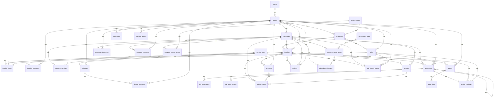

# Entity relationship diagram

Every foreign key between public tables. Generated from the migrations. Renders in GitHub, VS Code and most Markdown viewers.

```mermaid
erDiagram
  profiles ||--o{ addresses : has
  service_areas ||--o{ addresses : has
  bookings ||--o{ booking_items : has
  service_types ||--o{ booking_items : has
  units ||--o{ booking_items : has
  bookings ||--o{ booking_messages : has
  profiles ||--o{ booking_messages : has
  addresses ||--o{ bookings : has
  companies ||--o{ bookings : has
  profiles ||--o{ bookings : has
  profiles ||--o{ companies : has
  companies ||--o{ company_documents : has
  profiles ||--o{ company_documents : has
  companies ||--o{ company_members : has
  profiles ||--o{ company_members : has
  companies ||--o{ company_service_areas : has
  service_areas ||--o{ company_service_areas : has
  companies ||--o{ company_services : has
  service_types ||--o{ company_services : has
  companies ||--o{ company_subscriptions : has
  subscription_plans ||--o{ company_subscriptions : has
  disputes ||--o{ dispute_messages : has
  profiles ||--o{ dispute_messages : has
  bookings ||--o{ disputes : has
  profiles ||--o{ disputes : has
  job_reports ||--o{ job_report_parts : has
  job_reports ||--o{ job_report_photos : has
  bookings ||--o{ job_reports : has
  companies ||--o{ job_reports : has
  job_reports ||--o{ job_reports : has
  profiles ||--o{ job_reports : has
  units ||--o{ job_reports : has
  bookings ||--o{ ledger_entries : has
  companies ||--o{ ledger_entries : has
  payments ||--o{ ledger_entries : has
  payouts ||--o{ ledger_entries : has
  profiles ||--o{ notifications : has
  bookings ||--o{ payments : has
  profiles ||--o{ payments : has
  bookings ||--o{ payouts : has
  companies ||--o{ payouts : has
  profiles ||--o{ platform_admins : has
  users ||--o{ profiles : has
  quotes ||--o{ quote_lines : has
  bookings ||--o{ quotes : has
  profiles ||--o{ quotes : has
  bookings ||--o{ reviews : has
  companies ||--o{ reviews : has
  profiles ||--o{ reviews : has
  job_reports ||--o{ service_reminders : has
  service_types ||--o{ service_reminders : has
  units ||--o{ service_reminders : has
  companies ||--o{ subscription_invoices : has
  company_subscriptions ||--o{ subscription_invoices : has
  bookings ||--o{ unit_access_grants : has
  companies ||--o{ unit_access_grants : has
  profiles ||--o{ unit_access_grants : has
  units ||--o{ unit_access_grants : has
  addresses ||--o{ units : has
  profiles ||--o{ units : has
```
